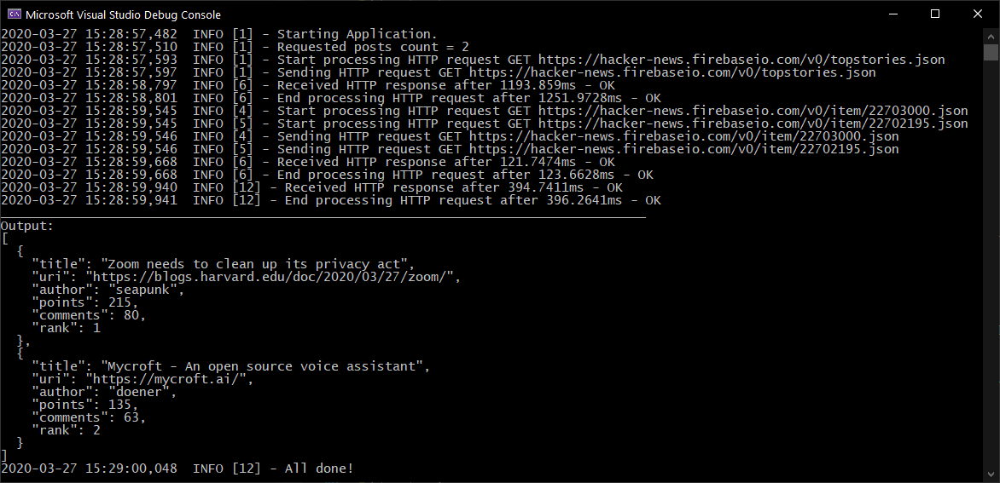

# TrueLayer HacherNews

> A simple console application to output the top stories from [HackerNews](https://news.ycombinator.com/)

- [TrueLayer HacherNews](#truelayer-hachernews)
  - [Prerequisites](#prerequisites)
  - [Build with](#build-with)
  - [Settings](#settings)
  - [Considerations](#considerations)
  - [Running the app](#running-the-app)
  - [Running the app with caching demo](#running-the-app-with-caching-demo)
  - [Running the unit tests](#running-the-unit-tests)
## Prerequisites

To Build this application you need the following:

- [Visual Studio 2019 (Latest version)](https://visualstudio.microsoft.com/) installed on your development machine. If you do not have Visual Studio, visit the previous link for download options. (**Note:** This tutorial was written with Visual Studio version 16.5. The steps in this guide may work with other versions, but that has not been tested.)

## Build with
- [.Net Core 3.1.3](https://dotnet.microsoft.com/download/dotnet-core/3.1#sdk-3.1.201/).
- [.LazyCache](https://github.com/alastairtree/LazyCache/) Caching the news items detail.
- [.NSubstitute](https://nsubstitute.github.io/) Mocking the objects in unit tests.
- [.FluentAssertion](https://fluentassertions.com/) More readable unit tests assertion.

## Settings
- HackerNews API base URL is specified in appsettings.json file and is easily changable and configurble for CI/CD pipe line.
- There is loggin setting as well which could be change by environment.

## Considerations
- The application is validating the news item detail before returning the result and if any of the new items was not valid, it will be ignored and next news item in the queue will be taken, process and return.
- The validations list are :
  - title and author are non empty strings not longer than 256 characters.
  - uri is a [valid URI](https://tools.ietf.org/html/rfc3986)
  - points, comments and rank are integers >= 0.
  
- The input arguments are validating and if posts count wasn't valid or didn't passed, the default posts count(100) will be considered to return the result.
- The Docker file added and the project is ready to containerize.
- We could have more granularity in services and test the functionalities in little pieces to follow SRP in better shape, But I tried to keep the project as simple as possible and split the functionalities to some reasonable classes.
- I would prefer to move the News related functionality to the separated library to be able to use it by different consumer types like Web API same as Console App. as I explained in the previous point I tried to keep it as simple as possible.

## Running the app

To run the app, follow the steps.

1 - Open Command Prompt and change the path to [application execution folder](./TrueLayer.HackerNews-Demo)

2 - Run the application by the following command

```
TrueLayer.HackerNews.exe [options]

options
    --posts : posts count flag
          n : posts count
```

Sending the posts count is optional and it will be considered as max(100) if it doesn't pass.

```
Examples:

C:\TrueLayer.HackerNews-Demo> TrueLayer.HackerNews.exe                   => Returns top 100(max) news items

C:\TrueLayer.HackerNews-Demo> TrueLayer.HackerNews.exe --posts 15        => Returns top 15 news items
```
[]()


## Running the app with caching demo

I've been used the caching for saving the news item detail to make it faster and reduce the API call when we run the app as a service.
To see how it works, you can run the application from [TrueLayer.HackerNews-Caching-Demo](./TrueLayer.HackerNews-Caching-Demo) and follow the instructions in the app after execution.

[]()

## Running the unit tests

Go to the test explorer window in Visual Studio and push the run button.

[]()